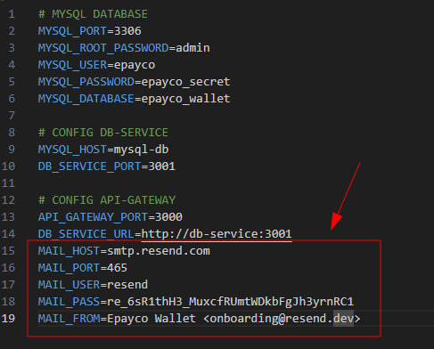

## Desarrollador Full Stack - Freddy Rojas

Este proyecto consiste en una billetera virtual desarrollada con una arquitectura de microservicios, un frontend moderno y completamente contenerizada para un despliegue sencillo.

---

### ✨ Features Implementadas

- [x] **Registro de Clientes:** Creación de nuevos usuarios en el sistema.
- [x] **Recarga de Billetera:** Añadir fondos a la cuenta de un cliente.
- [x] **Proceso de Pago en dos pasos:**
  - [x] Solicitud de pago y envío de token de confirmación por email.
  - [x] Confirmación de pago con token y débito del saldo.
- [x] **Consulta de Saldo:** Verificación del saldo disponible.

---

### 🛠️ Stack Tecnológico

A continuación, el stack utilizado para construir esta solución:

**Frontend:**

- 
- 
- 
- 
- 
- 

**Backend (Microservicios):**

- 
- 
- 

**DevOps & Herramientas:**

- 
- 
- 

---

### 🏗️ Arquitectura de la Solución

El proyecto sigue una arquitectura de microservicios para desacoplar responsabilidades y mejorar la escalabilidad.

- **`Cliente (Vue.js)`**: Interfaz de usuario que consume el API Gateway.
- **`API Gateway (NestJS)`**: Servicio de cara al cliente. Orquesta las peticiones y se comunica con los servicios internos. No tiene acceso directo a la BD.
- **`Servicio de Billetera (NestJS)`**: Microservicio que gestiona toda la lógica de negocio y tiene acceso exclusivo a la base de datos MySQL a través de TypeORM.

---

## Instrucciones necesarias para configurar y ejecutar el proyecto utilizando Docker y Docker Compose

## Requisitos Previos

Antes de comenzar, asegúrate de tener instaladas las siguientes herramientas en tu sistema:

- **Docker:** Para la gestión de contenedores.
- **Docker Compose:** Para orquestar los servicios definidos en la aplicación.

### Versiones Testeadas

El entorno ha sido probado con las siguientes versiones. Versiones más recientes deberían ser compatibles:

- **Docker Engine:** `v28.1.1`
- **Docker Compose:** `v2.40.2`

---

## Instalación y Configuración

Sigue estos pasos para levantar el entorno de desarrollo localmente.

### 1. Clonar el Repositorio

Si aún no lo has hecho, clona el repositorio en tu máquina local:

```bash
git clone https://github.com/RLFreddy/Epayco-wallet
cd Epayco-wallet
```

### 2. Configuración de Variables de Entorno

La aplicación requiere un archivo de variables de entorno para funcionar correctamente. Puedes crear el tuyo a partir del archivo de ejemplo proporcionado:

```bash
cp .env.example .env
```

Una vez creado, abre y edita el archivo `.env` para configurar tus propias credenciales de base de datos, claves de API y, lo más importante, la configuración del servidor de correo.

### 3. ¡IMPORTANTE! Configuración del Servidor SMTP

El servidor SMTP **Resend** configurado por defecto en el archivo de ejemplo está asociado a una cuenta específica y no funcionará para otros usuarios.  
Debes reemplazarlo con tu propio proveedor de correo para que el envío de emails funcione.



> **Nota sobre Gmail:** Para usar Gmail, necesitas generar una "Contraseña de Aplicación" desde la configuración de seguridad de tu cuenta de Google. No uses tu contraseña de inicio de sesión principal.

---

## Uso de la Aplicación

Una vez configurado el archivo `.env`, puedes gestionar los contenedores con los siguientes comandos.

### Levantar los Contenedores

Este comando construirá las imágenes (si es la primera vez o si hay cambios) y levantará todos los servicios definidos en el archivo `docker-compose.yml`:

```bash
docker compose up --build
```

La aplicación estará disponible en la URL y puerto que hayas configurado (generalmente `http://localhost:8080`).

### Acceso a la Documentación del API

Puedes acceder a la documentación interactiva del API (Swagger) en:

```
http://localhost:3000/api-docs
```

### Acceso al json de swagger para POSTMAN

También puedes obtener la **documentación en formato JSON**:

```
http://localhost:3000/api-docs-json
```

---

### Colección Postman

Para facilitar las pruebas, puedes importar la colección de Postman que contiene todos los endpoints del API.

1. Abre Postman.
2. Ve a **File → Import → Link** (o **Upload** si tienes el archivo `.json`).
3. Ingresa el URL de la colección o selecciona el archivo:

```
http://localhost:3000/api-docs-json
```

Una vez importada, podrás ejecutar todos los endpoints directamente desde Postman.

---

### Detener los Contenedores

Para detener todos los servicios y eliminar contenedores, redes y volúmenes asociados, utiliza:

```bash
docker compose down -v
```

> El flag `-v` asegura que los volúmenes de la base de datos también se eliminen, lo que es útil para un reinicio limpio.
